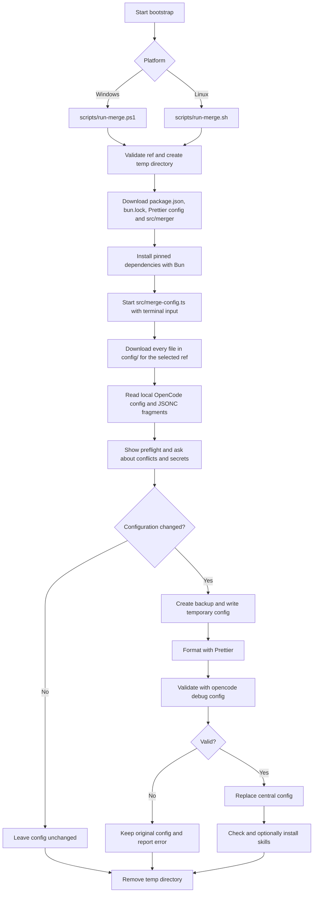

# OpenCode Configuration

Scripts and configuration fragments for installing and configuring OpenCode on
Windows and Linux.

## TL;DR

Run the merger without cloning the repository:

```powershell
& ([scriptblock]::Create((irm "https://raw.githubusercontent.com/KeesCBakker/keestalkstech-code-gallery/main/15.opencode/scripts/run-merge.ps1")))
```

```sh
curl -fsSL https://raw.githubusercontent.com/KeesCBakker/keestalkstech-code-gallery/main/15.opencode/scripts/run-merge.sh | bash
```

The scripts install the pinned dependencies, merge the configuration, validate
it, and remove their temporary files. They prompt before changing conflicting
settings or installing missing skills.

## Quick start

Install OpenCode first. On Windows, run PowerShell:

```powershell
./scripts/install-opencode.ps1
```

On Linux, run the shell installer:

```sh
bash scripts/install-opencode.sh
```

The Windows installer uses WinGet. The Linux installer uses OpenCode's official
Linux installer. Both check that `opencode` and `bun` are available before you
continue.

From either platform, install the pinned dependencies and run the TypeScript
merge from this directory:

```powershell
bun install --frozen-lockfile
bun run merge
```

The script finds the central `opencode.jsonc` or `opencode.json`, creates a
timestamped backup, and shows a preflight summary. It then:

- Adds missing configuration values.
- Asks before replacing different values.
- Asks before adding or replacing MCPs.
- Creates missing MCP secret files without overwriting existing files.
- Merges watcher ignore patterns.
- Uses Microsoft's `jsonc-parser` for targeted, comment-preserving JSONC edits.
- Formats changed configuration with the project Prettier settings before validation.
- Validates the result with `opencode debug config`.
- Checks and optionally installs the configured global OpenCode skills.

If there are no configuration changes, the central file is left byte-for-byte unchanged.

The merger downloads all files in its `config` directory and applies the
configuration. The bootstraps remove their temporary files afterwards. Use a
commit SHA instead of `main` in the URL when reproducibility is important, and
pass the same SHA as `-Ref` (PowerShell) or the first argument (shell) to keep
the downloaded files on that revision.



The PowerShell scripts remain available as a fallback during the TypeScript
migration:

```powershell
./scripts/merge-config.ps1
```

## Configuration files

The configuration fragments are kept in the `config` directory:

- `config/opencode*.jsonc`: configuration fragments, merged in filename order
- `config/opencode-skills.yaml`: optional skills and their repositories
- `src/merge-config.ts`: Bun-based JSONC merge
- `scripts/`: installers and platform bootstraps

OpenCode does not automatically include arbitrary JSONC files; the merge script
combines these fragments with the central configuration.

After a successful config merge, the merge program checks the optional skills.
It skips skills that are already installed and asks before installing each
missing skill. The skill list lives in `config/opencode-skills.yaml`.

## Secrets

Only the Context7 and Slack examples use credential files. The other configured
servers do not need a key in these fragments: Playwright runs locally, and the
Atlassian and AWS Knowledge endpoints use their configured remote URLs.

- **Context7:** create an API key in the [Context7 dashboard](https://context7.com/dashboard).
  The key is optional; it gives you higher rate limits. Context7 is enabled in
  the example, so enter the key when the merger prompts for it.
- **Slack:** create a Slack app and obtain its OAuth client ID and client
  secret. See the [Slack MCP server setup](https://docs.slack.dev/ai/slack-mcp-server/).
  Slack is disabled by default, so you only need these values if you choose to
  enable that server.

The merger stores supplied values as separate files under the central
`~/.config/opencode/secrets` directory. It asks for each missing referenced
file and never overwrites an existing one. Leave a prompt empty to skip saving
that value; the corresponding MCP will then be unable to authenticate until
you add the secret later.

The project contains references only, never secret values:

```text
{file:./secrets/context7-api-key}
{file:./secrets/slack-client-id}
{file:./secrets/slack-client-secret}
```

## Notes

- The central configuration is changed only after validation succeeds.
- Existing comments and formatting are preserved by targeted `jsonc-parser` edits.
- `@clack/prompts`, `jsonc-parser`, `prettier`, `yaml`, and the `skills` CLI are pinned in `bun.lock`.
- The generated local config is ignored by Git.

## Tests

```powershell
bun run test
```
