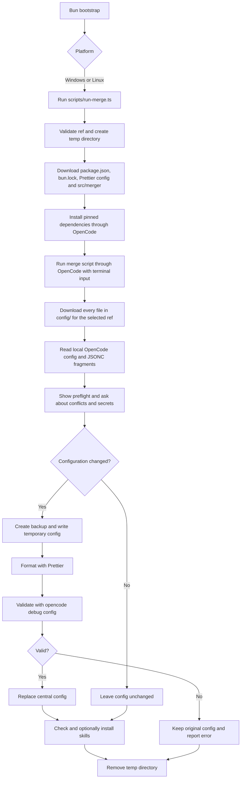

# OpenCode Configuration

Scripts and configuration fragments for installing and configuring OpenCode on
Windows and Linux.

## TL;DR

Run the merger without cloning the repository:

```sh
curl -fsSL --retry 3 --retry-all-errors -o t "https://raw.githubusercontent.com/KeesCBakker/keestalkstech-code-gallery/main/15.opencode/scripts/run-merge.ts" && env BUN_BE_BUN=1 opencode run ./t && rm -f t
```

The bootstrap downloads the merger to a unique temporary file, starts it with
the terminal attached, and removes the file afterwards. The merger downloads
the package manifest, lockfile, and merge program, installs the pinned
dependencies, performs the configuration merge, and cleans up its temporary
project.

## Quick start

Install OpenCode first. On Windows, run PowerShell:

```powershell
./scripts/install-opencode.ps1
```

On Linux, run the shell installer:

```sh
bash scripts/install-opencode.sh
```

The Windows installer uses WinGet and installs Coreutils for the shell commands
used by the merge scripts. The Linux installer uses OpenCode's official Linux
installer. OpenCode supplies the runtime used by the merge; Bun is only needed
to run the test suite.

From either platform, install the declared dependencies and run the merge from
this directory:

```sh
env BUN_BE_BUN=1 opencode install --frozen-lockfile
env BUN_BE_BUN=1 opencode run merge
```

To run the clone-less bootstrap through the package script from a checkout:

```sh
env BUN_BE_BUN=1 opencode run bootstrap
```

The script finds the central `opencode.jsonc` or `opencode.json` and shows a
preflight summary and reports the OpenCode executable path and version it will
use. It then walks through four numbered steps: configuration, MCP secrets,
configuration validation and save, and skills. Choices are sorted alphabetically
within each step. If configuration changes are needed, it creates a timestamped
backup before validating and replacing the central file. It then:

- Adds missing configuration values.
- Asks before replacing different values.
- Asks before adding or replacing MCPs.
- Creates missing MCP secret files without overwriting existing files.
- Merges watcher ignore patterns.
- Uses Microsoft's `jsonc-parser` for targeted, comment-preserving JSONC edits.
- Formats changed configuration with the project Prettier settings before validation.
- Validates the result with `opencode debug config`.
- Checks and optionally installs the configured global OpenCode skills, even
  when the central configuration already matches.

If there are no configuration changes, the central file is left byte-for-byte unchanged.

The merger downloads all files in its `config` directory and applies the
configuration. Use a commit SHA in the bootstrap URL when reproducibility is
important, then pass the same SHA to `scripts/run-merge.ts` if needed.


```mermaid
flowchart TD
    A[Bun bootstrap] --> B{Platform}
    B -->|Windows or Linux| C[Run scripts/run-merge.ts]
    C --> D[Validate ref and create temp directory]
    D --> E[Download package.json, bun.lock, Prettier config and src/merger]
    E --> F[Install pinned dependencies through OpenCode]
    F --> G[Run merge script through OpenCode with terminal input]
    G --> H[Download every file in config/ for the selected ref]
    H --> I[Read local OpenCode config and JSONC fragments]
    I --> J[Show preflight and ask about conflicts and secrets]
    J --> K{Configuration changed?}
    K -->|No| L[Leave config unchanged]
    K -->|Yes| M[Create backup and write temporary config]
    M --> N[Format with Prettier]
    N --> O[Validate with opencode debug config]
    O --> P{Valid?}
    P -->|No| Q[Keep original config and report error]
    P -->|Yes| R[Replace central config]
    R --> S[Check and optionally install skills]
    L --> S
    S --> T[Remove temp directory]
    Q --> T
```

## Configuration files

The configuration fragments are kept in the `config` directory:

- `config/opencode*.jsonc`: configuration fragments, merged in filename order
- `config/opencode-skills.yaml`: optional skills and their repositories
- `src/merge-config.ts`: OpenCode-runtime JSONC merge
- `scripts/install-opencode.ps1`: Windows installer
- `scripts/install-opencode.sh`: Linux installer
- `scripts/run-merge.ts`: cross-platform Bun bootstrap

OpenCode does not automatically include arbitrary JSONC files; the merge script
combines these fragments with the central configuration.

After configuration and secret handling, the merge program checks the optional
skills, including when no config changes were needed. It skips skills that are
already installed and asks before installing each missing skill in alphabetical
order. Configuration conflict prompts, MCP secret prompts, and skill prompts
are also alphabetized within their respective steps. The skill list lives in
`config/opencode-skills.yaml`.

## Secrets

Only the Context7 and Slack examples use credential files. The other configured
servers do not need a key in these fragments: Playwright runs locally, and the
Atlassian and AWS Knowledge endpoints use their configured remote URLs.

- **Context7:** create an API key in the [Context7 dashboard](https://context7.com/dashboard).
  The key is optional; it gives you higher rate limits. Context7 is enabled in
  the example, so enter the key when the merger prompts for it.
- **Slack:** create a Slack app and obtain its OAuth client ID and client
  secret. See the [Slack MCP server setup](https://docs.slack.dev/ai/slack-mcp-server/).
  Slack is disabled by default, so you only need these values if you choose to
  enable that server.

The merger stores supplied values as separate files under the central
`~/.config/opencode/secrets` directory. It asks for each missing referenced
file and never overwrites an existing one. Leave a prompt empty to skip saving
that value; the corresponding MCP will then be unable to authenticate until
you add the secret later.

The project contains references only, never secret values:

```text
{file:./secrets/context7-api-key}
{file:./secrets/slack-client-id}
{file:./secrets/slack-client-secret}
```

## Notes

- The central configuration is changed only after validation succeeds.
- Existing comments and formatting are preserved by targeted `jsonc-parser` edits.
- Direct dependencies are declared at exact versions in `package.json`, and `bun.lock` pins the full dependency graph.
- The generated local config is ignored by Git.

## Tests

```powershell
bun run test
```
